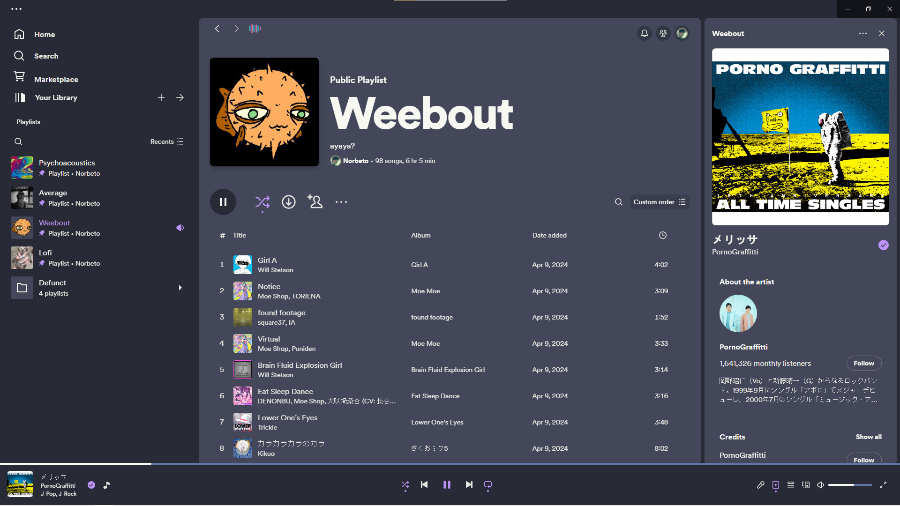

# MaybeBetterSleek
A fork of [Sleek](https://github.com/spicetify/spicetify-themes/tree/master/Sleek) that should give slightly more customizability.

## Screenshots
#### Samurized
|          |           |          |
| :-------------------------------------------: | :---------------------------------------------: | :-----------------------------------------------: |
|                     home                      |                      album                      |                     playlist                      |
|       |         |        |
|                    podcast                    |                     profile                     |                    lyrics plus                    |

#### Nord
|               |                |               |
| :-------------------------------------------: | :---------------------------------------------: | :-----------------------------------------------: |
|                     home                      |                      album                      |                     playlist                      |
|            |              |             |
|                    podcast                    |                     profile                     |                    lyrics plus                    |

#### Dracula
|            |             |            |
| :-------------------------------------------: | :---------------------------------------------: | :-----------------------------------------------: |
|                     home                      |                      album                      |                     playlist                      |
|         |           |          |
|                    podcast                    |                     profile                     |                    lyrics plus                    |

#### Rosé Pine
|           |            |           |
| :-------------------------------------------: | :---------------------------------------------: | :-----------------------------------------------: |
|                     home                      |                      album                      |                     playlist                      |
|        |          |         |
|                    podcast                    |                     profile                     |                    lyrics plus                    |

## Manual Install
Create a folder in Spicetify themes path and add `user.css` and `color.ini` to it. <br/>
On windows, the path usually is `%APPDATA%/spicetify/Themes`.<br/>
If you're on Linux, I assume you can find out the path by yourself.

To apply:
```
spicetify config current_theme [name of folder in themes dir] color_scheme Samurized
```

To change the color scheme:
```
spicetiy config color_scheme [name of color scheme]
```

#### NOTE:
Just a quick note because I only found the solution in a reddit thread and wanted to make it more accessible. </br>
If you want the queue to be displayed on the sidepanel, you can enable `Enable queue on the right panel` in the `Experimental Features` tab.
